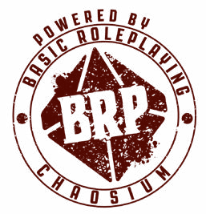

# BRP Codex

A compendium of material for the [Basic Roleplaying Ultimate Game Engine][brp-hardback].

## ORC Content Document

### Credits

Compiled by Justin Hamilton.

Based on the Basic Roleplaying system created by Steve Perrin, Steve Henderson, Warren James, Greg Stafford, Sandy Petersen, Ray Turney, Lynn Willis

**BRP:UGE Authors** Jason Durall and Steve Perrin

**BRP:UGE Producer** Neil Robinson

**BRP:UGE Additional Credits** Daria Pilarczyk, Rick Meints, Michael O’Brien, and Jeff Richard

### ORC Notice

This product is licensed under the ORC License held in the Library of Congress at TX 9-307-067 and available online at various locations including [www.chaosium.com/orclicense](https://www.chaosium.com/orclicense), [www.azoralaw.com/orclicense](https://www.azoralaw.com/orclicense), [www.paizo.com/orclicense](https://paizo.com/orclicense) and others. All warranties are disclaimed as set forth therein. This product is the original work of Chaosium.

If you use our ORC Content, please also credit us as follows:

With a very few exceptions (trademarked terms), the text of BASIC ROLEPLAYING: UNIVERSAL GAME ENGINE is available for personal and commercial use under the ORC license.

[brp-hardback]: https://www.chaosium.com/basic-roleplaying-universal-game-engine-hardcover/?srsltid=AfmBOorwvvMLKuRAxn8IG8OaVZcV5RRdegr-e1aRHhFYZQYGi5aZh6yC